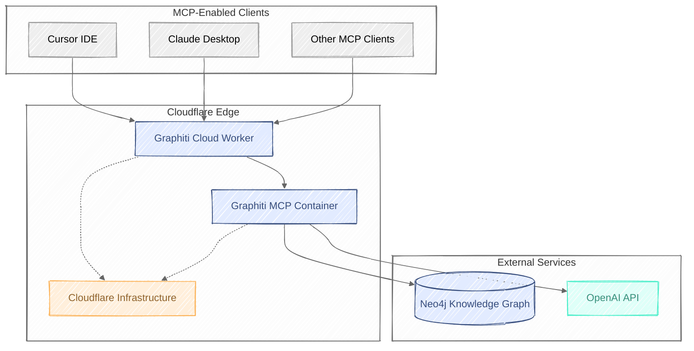

# Graphiti Cloud via Cloudflare Workers

[![GitHub Actions Workflow Status][workflow-src]][workflow-href]
[![License][license-src]][license-href]

[](https://deploy.workers.cloudflare.com/?url=https%3A%2F%2Fgithub.com%2Fadam-paterson%2Fcloudflare-grafitti-mcp-server)

A Cloudflare Container Worker that serves as a proxy for the Graphiti MCP (Model Context Protocol) server, providing scalable, serverless access to AI agent memory capabilities through Neo4j-backed knowledge graphs.

## Overview

Graphiti Cloud bridges the gap between AI applications and persistent memory by leveraging Cloudflare's new container service to host and proxy requests to a Graphiti MCP server. This enables AI agents to maintain context and memory across interactions using a powerful knowledge graph backend.


## Features

- **Serverless Architecture**: Built on Cloudflare Workers with container support
- **AI Memory Service**: Persistent memory for AI agents via knowledge graphs
- **Neo4j Integration**: Robust graph database for complex relationship storage
- **Auto-scaling**: Up to 5 container instances with intelligent sleep management
- **Global Edge Network**: Deployed across Cloudflare's global infrastructure
- **Secure**: Environment-based configuration for sensitive credentials

## Architecture



## Quick Start

### Prerequisites

- [Node.js](https://nodejs.org/) (v18 or later)
- [pnpm](https://pnpm.io/) package manager
- [Wrangler CLI](https://developers.cloudflare.com/workers/wrangler/)
- [Neo4j database instance](#neo4j-setup)
- [OpenAI API key](https://platform.openai.com/api-keys)

### Neo4j Setup

You'll need a Neo4j database to store the knowledge graph. Here are your options:

1. **Neo4j AuraDB (Recommended)** - Fully managed cloud service
   - Sign up at [Neo4j AuraDB](https://neo4j.com/cloud/platform/aura-graph-database/)
   - Create a free instance (up to 200k nodes and 400k relationships)
   - Get your connection URI, username, and password

2. **Self-hosted Neo4j**
   - [Download Neo4j Community Edition](https://neo4j.com/download/)
   - Follow the [installation guide](https://neo4j.com/docs/operations-manual/current/installation/)

3. **Neo4j Desktop**
   - [Download Neo4j Desktop](https://neo4j.com/download/)
   - Create a local database for development

> **Learn more about Neo4j**: Neo4j is a graph database that stores data as nodes and relationships, making it perfect for knowledge graphs. Check out the [Neo4j Graph Database Concepts](https://neo4j.com/docs/getting-started/current/graphdb-concepts/) guide.

### Installation

1. Clone the repository:

```bash
git clone https://github.com/adam-paterson/graphiti-cloud.git
cd graphiti-cloud
```

2. Install dependencies:

```bash
pnpm install
```

3. **For Development**: Configure environment variables in `.dev.vars`:

```bash
NEO4J_URI=neo4j://your-neo4j-instance:7687
NEO4J_USER=your-username
NEO4J_PASSWORD=your-password
OPENAI_API_KEY=your-openai-api-key
BEARER_TOKEN=your-secure-bearer-token
```

4. **For Production**: Add secrets to your Cloudflare Worker:

```bash
# Add each secret using wrangler
wrangler secret put NEO4J_URI
wrangler secret put NEO4J_USER
wrangler secret put NEO4J_PASSWORD
wrangler secret put OPENAI_API_KEY
wrangler secret put BEARER_TOKEN
```

> **Learn more**: See the [Cloudflare Workers Secrets documentation](https://developers.cloudflare.com/workers/configuration/secrets/) for detailed instructions on managing secrets.

### Development

Start the development server:

```bash
pnpm dev
```

The worker will be available at `http://localhost:8787`

#### Debugging with MCP Inspector

For debugging the MCP protocol communication, you can use the official MCP Inspector:

```bash
# Install the MCP Inspector globally
npm install -g @modelcontextprotocol/inspector

# Start the inspector pointing to your local worker
mcp-inspector http://localhost:8787
```

This will open a web interface where you can:

- Send MCP protocol requests
- View request/response payloads
- Debug the communication between your client and the Graphiti MCP server

> **Learn more**: Check out the [MCP Inspector documentation](https://modelcontextprotocol.io/docs/tools/inspector) for advanced debugging techniques.

### Deployment

Deploy to Cloudflare:

```bash
wrangler deploy
```

## Configuration

### Container Settings

The `GraphitiMCPContainer` class extends Cloudflare's Container with these configurations:

- **Default Port**: 8000
- **Sleep Timeout**: 1 hour of inactivity
- **Internet Access**: Enabled for external API calls
- **Max Instances**: 5 containers
- **Image**: `knowledge-graph-mcp:0.4.0`

### Environment Variables

| Variable | Description | Required | Example |
|----------|-------------|----------|---------|
| `NEO4J_URI` | Neo4j database connection string | | `neo4j://localhost:7687` or `neo4j+s://xxx.databases.neo4j.io` |
| `NEO4J_USER` | Neo4j username | | `neo4j` |
| `NEO4J_PASSWORD` | Neo4j password | | `your-secure-password` |
| `OPENAI_API_KEY` | OpenAI API key for AI functionality | | `sk-...` |
| `BEARER_TOKEN` | Bearer token for authentication | | `your-secure-bearer-token` |

## Usage

### Basic Proxy Request

All requests are proxied to the Graphiti MCP container:

```javascript
// Example client request
const response = await fetch('https://your-worker.your-subdomain.workers.dev/', {
  method: 'POST',
  headers: {
    'Content-Type': 'application/json',
  },
  body: JSON.stringify({
    // MCP protocol request
  })
})
```

### Integration with AI Applications

Graphiti Cloud is designed to work with AI applications that support the MCP protocol:

```javascript
import { MCPClient } from '@modelcontextprotocol/client'

const client = new MCPClient({
  serverUrl: 'https://your-worker.your-subdomain.workers.dev/'
})

// Use the client to interact with the knowledge graph
await client.addMemory({
  content: 'User prefers dark mode',
  context: 'user-preferences'
})
```

## Development

### Project Structure

```
graphiti-cloud/
├── src/
│   └── index.ts          # Main worker and container logic
├── test/
│   ├── index.spec.ts     # Test specifications
│   └── env.d.ts          # Environment type definitions
├── wrangler.jsonc        # Cloudflare Worker configuration
├── package.json          # Project dependencies
└── README.md            # This file
```

### Scripts

- `pnpm dev` - Start development server
- `pnpm lint` - Run ESLint
- `pnpm types` - Generate Wrangler types

### Testing

Currently, Cloudflare's test suite doesn't fully support containers. Integration testing is recommended using the deployed worker.

## Contributing

1. Fork the repository
2. Create a feature branch: `git checkout -b feature/amazing-feature`
3. Commit your changes: `git commit -m 'Add amazing feature'`
4. Push to the branch: `git push origin feature/amazing-feature`
5. Open a Pull Request

## Related Projects

- [Graphiti](https://github.com/getzep/graphiti) - The underlying MCP server for knowledge graphs
- [Model Context Protocol](https://modelcontextprotocol.io/) - The protocol specification
- [Cloudflare Containers](https://developers.cloudflare.com/containers/) - Cloudflare's container service
- [Neo4j](https://neo4j.com/) - The graph database powering the knowledge storage

## License

[MIT](./LICENSE.md) License  [Adam Paterson](https://github.com/adam-paterson)

## Support

- Email: [hello@adampaterson.co.uk]
- Issues: [GitHub Issues](https://github.com/adam-paterson/graphiti-cloud/issues)
- Discussions: [GitHub Discussions](https://github.com/adam-paterson/graphiti-cloud/discussions)

---

<p align="center">
  <sub>Built with  using Cloudflare Workers and the power of knowledge graphs</sub>
</p>

<!-- Badges -->
[workflow-src]: https://img.shields.io/github/actions/workflow/status/adam-paterson/cloudflare-grafitti-mcp-server/ci.yml?style=for-the-badge
[workflow-href]: https://github.com/adam-paterson/cloudflare-grafitti-mcp-server/actions/workflows/ci.yml
[license-src]: https://img.shields.io/github/license/adam-paterson/cloudflare-grafitti-mcp-server.svg?style=for-the-badge&colorA=080f12&colorB=1fa669
[license-href]: https://github.com/adam-paterson/cloudflare-grafitti-mcp-server/blob/main/LICENSE.md
